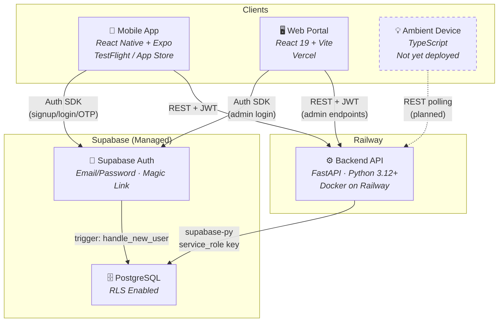
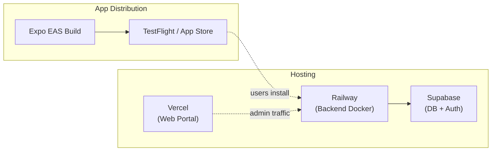
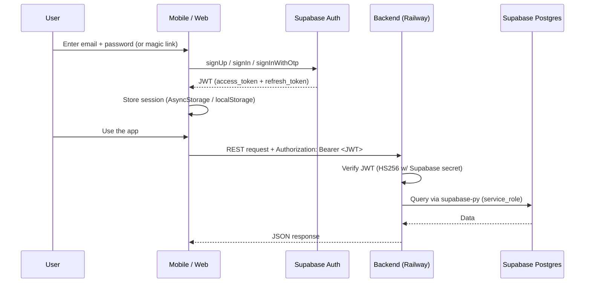
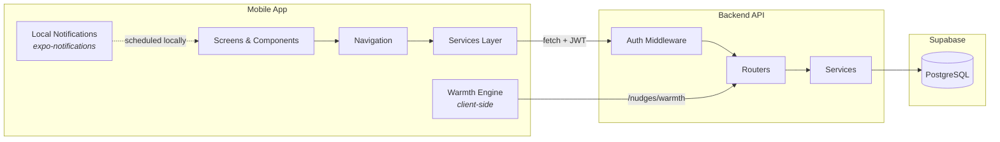
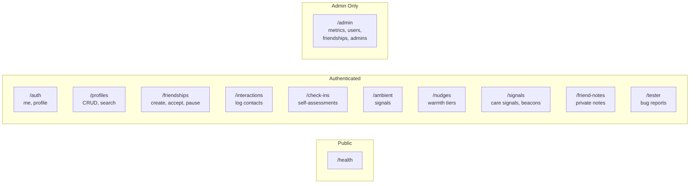
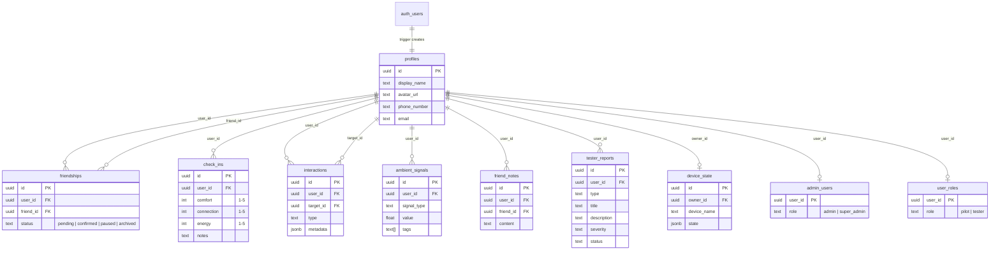

# Friendly — Deployed Architecture

> Last updated: 2026-02-13

## System Overview

## Deployment Map

## Authentication Flow

## Data Flow

## Backend API Surface

## Database Schema

## Infrastructure Summary

| Component | Stack | Host | Notes |
|-----------|-------|------|-------|
| **Mobile App** | React Native + Expo (TS) | TestFlight / App Store | Bundle ID: `com.kylerand.friendly` |
| **Web Portal** | React 19 + Vite (TS) | Vercel | Admin dashboard |
| **Backend API** | FastAPI (Python 3.12+) | Railway (Docker) | `/health` endpoint for probes |
| **Database** | PostgreSQL | Supabase | RLS enabled on all tables |
| **Auth** | Supabase Auth | Supabase | Email/password + magic link + OTP |
| **Build Pipeline** | Expo EAS | Expo | Project: `ea2d376b-...` |
| **Ambient Device** | TypeScript | _Not deployed_ | State machine scaffold for hardware display |

## Key Design Decisions

- **No direct DB writes from clients** — all data mutations go through the backend API
- **Supabase client on mobile/web is auth-only** — used for signup, login, token management
- **Backend uses service_role key** — bypasses RLS for cross-user queries (nudges, admin)
- **No server-side push notifications yet** — client-side local scheduling via `expo-notifications`
- **No background jobs or cron** — all computation is request-driven
- **Anti-metrics by design** — engagement metrics explicitly forbidden (no DAU, session length, CTR)
